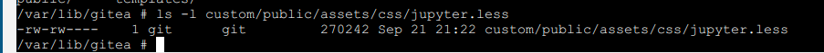

## Changed content

- Support render jupyter(suffix: `.ipynb`)

### Support render jupyter

refers to [render-jupyter-notebooks](https://blog.gitea.com/render-jupyter-notebooks/)

#### extract styles for jupyter notebook

1. exec command below to extract styles for jupyter notebook

    ```bash
    jupyter nbconvert --to html --template basic path/to/some/test/notebook.ipynb
    ```

2. open the generated html file（`*.html`）, and copy the styles to `jupyter.less`(must strip out all of style sheets, such as `<style></style>`)

3. wrap the styles with `.markup.jupyter {}` in `jupyter.less`：

    ```less
    .markup.jupyter {
        /* styles */
    }
    ```

4. put the `jupyter.less` to `custom/public/assets/css/jupyter.less` directory:

    

#### set header.tmpl

add the following configuration to `custom/templates/header.tmpl`:

```html
<link rel="stylesheet/less" type="text/css" href="/assets/css/jupyter.less" />
<script src="//cdn.jsdelivr.net/npm/less" ></script>
```

#### set app.ini

add the following configuration to `app.ini`:

```ini
; Gitea looks for markup.xxxxx and will apply both "markup" and "xxxxx" as a class to the parent <div>
[markup.jupyter]
ENABLED = true
; all the file extensions we want to convert, comma separated.
FILE_EXTENSIONS = .ipynb
; Lets use out nbconvert command from earlier - making to sure to convert to HTML and to output to stdout
RENDER_COMMAND = "jupyter nbconvert --stdout --to html --template basic "
; nbconvert accepts a path to a file and not stdin
IS_INPUT_FILE = true

; the name after sanitizer doesn't really matter
[markup.sanitizer.jupyter0]
; Jupyter chiefly uses divs
ELEMENT = div
; we will need access to html classes later
ALLOW_ATTR = class
; we don't mind which classes we keep, so let's keep all of them
REGEXP =
```
